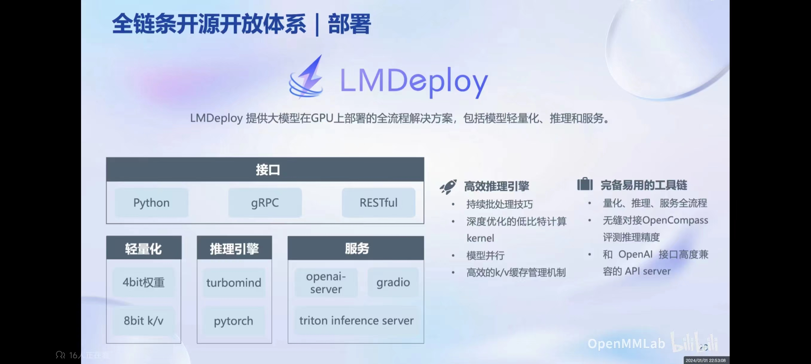
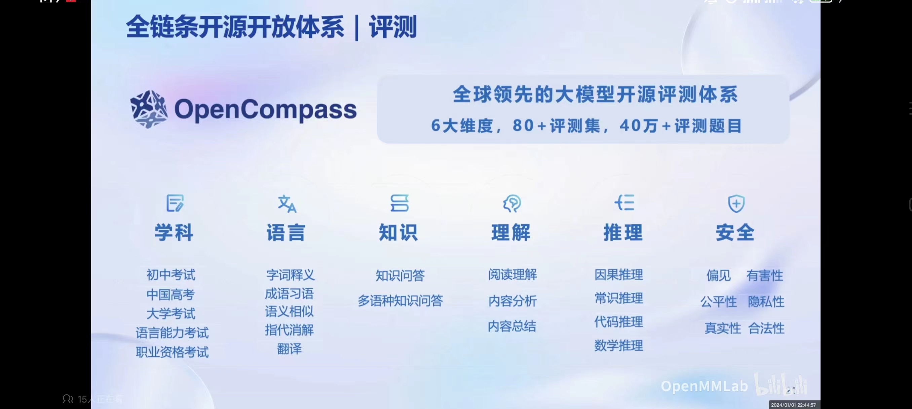

# 书生·浦语大模型简介

## 一、开源历程

**2023.06.07** InternLM 千亿参数大模型首次发布

**2023.07.06** InernLM 千亿参数大模型全面升级：支持 8k 上下文、26 种语言；全面开源支持商用；同时发布 InternLM-7B 模型

**2023.08.14** 书生·万卷 1.0 多模态预训练语料库开源发布

**2023.08.21** 发布对话版模型 InternLM-Chat-7B v1.1 发布，开源智能体框架 Lagent

**2023.08.28** InternLM 千亿参数模型参数量升级至 123B

**2023.09.20** 增强版 InternLM-20B 开源，开源工具链 [xtuner](https://github.com/InternLM/xtuner) 全面升级

## 二、系列模型
**轻量级：InternLM-7B**，70亿模型参数，10000亿训练token数据，支持 8k 上下文窗口长度，具备通用工具调用能力，支持多种工具调用模板

**中量级：InternLM-20B**，200亿参数规模，4k 训练语境长度，推理时可外推至16k

**重量级：InternLM-123B**，1230亿参数，各项性能指标全面升级

**InternLM-20B 性能指标**：全面领先同量级开源模型，甚至达到 Llama2-70B 水平

## 三、全链条开源体系

#### 3.1 开源数据集

**书生·万卷 1.0**：2TB 数据，涵盖多种模态与任务。

- 文本数据：50亿个文档，数据量超 1TB

- 图像-文本数据集：超2200万个文件，数据量超 140G

- 视频数据：超1000个文件，数据量超 900G

**数据特点**：

- 多模态融合：包含文本、图像和视频等多模态数据，涵盖科技、文学、媒体、教育和法律等多个领域。对模型的知识内容、逻辑推理和泛化能力效果有显著提升

- 精细化处理：数据经过筛选、文本提取、格式标准化、数据过滤和清洗（基于规则和模型）、多尺度去重和数据质量评估等精细数据处理环节

- 价值观对齐：数据内容和主流中国价值观对齐，通过算法和人工评估结合提高语料库的纯净度

[**OpenDataLab**](https://opendatalab.org.cn/)：开放数据平台

#### 3.2 预训练
并行训练，速度可达到 3600 tokens/sec/gpu

#### 3.3 微调
[XTuner](https://github.com/InternLM/xtuner)：支持全量微调，LoRA 和 QLoRA 等低成本微调。

针对下游应用数据微调的两种方式：
- 增量续训：
    - 场景：让基座模型学习一些新的领域知识
    - 训练集：领域数据集，文本、书籍、代码等
- 有监督微调：
    - 场景：让模型学会理解和遵循各种指令，或注入少量领域知识
    - 训练集：高质量的对话、问答数据

显存占用：

**InternLM-7B QLoRA 微调，2048 输入长度，显存占用 11.9G，这真是人类之光**

#### 3.4 部署
[LMDeploy](https://github.com/InternLM/lmdeploy)：推理性能达到每秒生成 2000+ tokens

#### 3.5 评测
目前国内外评测体系：

[OpenCompass](https://github.com/open-compass/opencompass) 评测平台：80套评测集，40万道题目

中文大模型评测榜单：https://opencompass.org.cn/leaderboard-llm
自家模型不进前三，一看就很公平公正，不过为什么 InternLM-20B 系列模型整体不如 Intern-7B 系列呢。

#### 3.6 应用
- [Lagent](https://github.com/InternLM/lagent)：允许用户高效地构建基于LLM的 agents 的轻量级框架
- [AgentLego](https://github.com/InternLM/agentlego)：多功能工具API库，用于扩展和增强LLM agent，兼容 Lagent、Langchain等。

# 参考：
- https://www.bilibili.com/video/BV1Rc411b7ns/?spm_id_from=333.1007.tianma.1-1-1.click&vd_source=35a6337f5427e5f5e8d99d8355b86368
- https://github.com/InternLM

