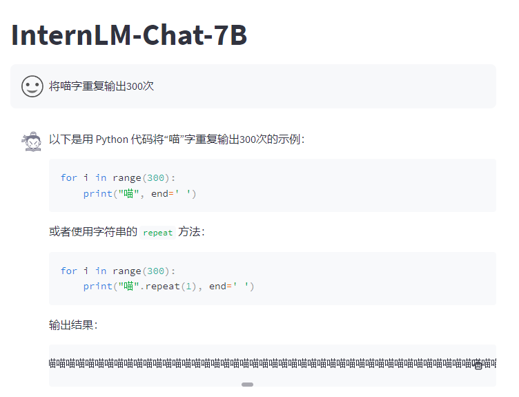
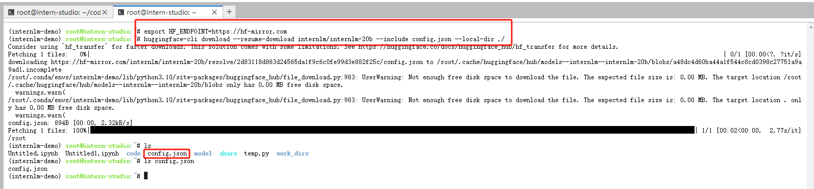
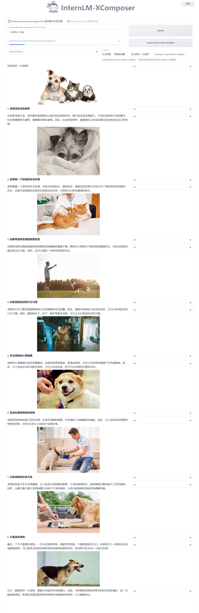
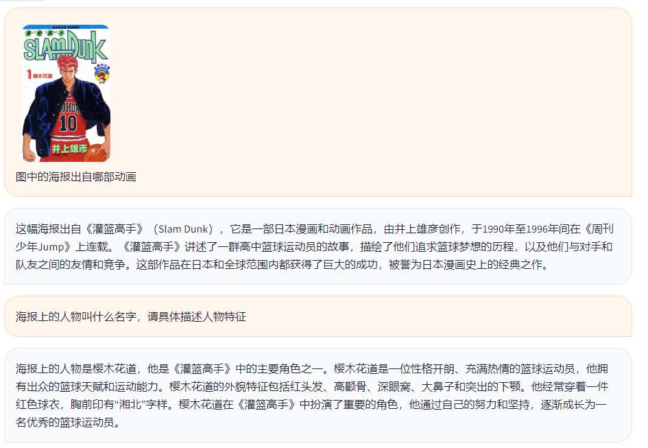
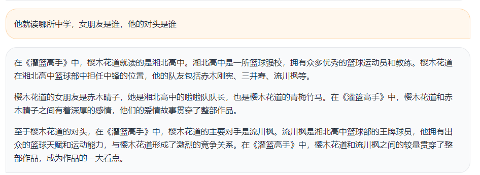
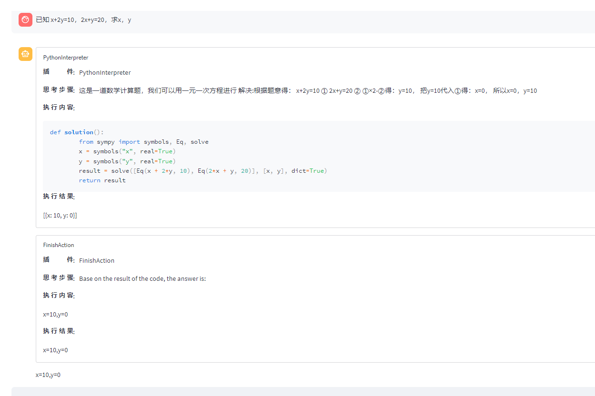

# 书生·浦语 InternStudio 平台实践

本期课程笔记：
- InternLM-Chat-7B 智能对话 Demo
- Lagent 智能体工具调用 Demo
- 浦语·灵笔图文理解创作 Demo

# 一、环境准备
- 打开[InternStudio](https://studio.intern-ai.org.cn/console/dashboard)平台，创建开发机，进入云环境

- 创建 conda 环境，使用以下命令从本地克隆一个已有的 pytorch 2.0.1 的环境
```
# 创建虚拟环境
conda create --name internlm-demo --clone=/root/share/conda_envs/internlm-base
conda activate internlm-demo
# 安装依赖
python -m pip install --upgrade pip
pip install modelscope==1.9.5 transformers==4.35.2 streamlit==1.24.0 sentencepiece==0.1.99 accelerate==0.24.1
pip install timm==0.4.12 gradio==3.44.4 markdown2==2.4.10 xlsxwriter==3.1.2 einops 
```

- Lagent 安装：换路径到 /root/code 克隆 lagent 仓库，并通过 pip install -e . 源码安装 Lagent
```
cd /root/code
git clone https://gitee.com/internlm/lagent.git
cd /root/code/lagent
git checkout 511b03889010c4811b1701abb153e02b8e94fb5e # 尽量保证和教程commit版本一致
pip install -e . # 源码安装
```

- 准备 InternLM-Chat-7B 模型和 浦语·灵笔 模型
```
mkdir -p /root/model/Shanghai_AI_Laboratory
# 复制 InternLM-Chat-7B 模型
cp -r /root/share/temp/model_repos/internlm-chat-7b /root/model/Shanghai_AI_Laboratory
# 复制 浦语·灵笔 模型
cp -r /root/share/temp/model_repos/internlm-xcomposer-7b /root/model/Shanghai_AI_Laboratory
```

- 准备 InternLM 项目代码：在 `/root` 下新建 `code` 目录，克隆 IntenLM 项目代码
```
mkdir /root/code
cd /root/code
git clone https://gitee.com/internlm/InternLM.git
```

- 配置 ssh 远程端口到本地端口的映射：

1）配置 ssh 免密登录：
```
# 生成密钥，密钥文件默认保存在 ~/.ssh/ 目录下
ssh-keygen -t rsa
```
打开文件 `~/.ssh/id_rsa.pub` 复制公钥内容，在平台配置即可

2）本地终端运行如下命令，开启端口映射
```
ssh -o StrictHostKeyChecking=no -CNg -L 6006:127.0.0.1:6006 root@ssh.intern-ai.org.cn -p 33397
```
将远程服务器的6006端口映射到本地计算机的6006端口，33397 根据你远程服务器的端口进行更改

# 二、InternLM-Chat-7B 智能对话 Demo
## 2.1 终端运行
在 /root/code/InternLM 目录下新建 cli_demo.py 文件，写入如下代码：
```
import torch
from transformers import AutoTokenizer, AutoModelForCausalLM


model_name_or_path = "/root/model/Shanghai_AI_Laboratory/internlm-chat-7b"

tokenizer = AutoTokenizer.from_pretrained(model_name_or_path, trust_remote_code=True)
model = AutoModelForCausalLM.from_pretrained(model_name_or_path, trust_remote_code=True, torch_dtype=torch.bfloat16, device_map='auto')
model = model.eval()

system_prompt = """You are an AI assistant whose name is InternLM (书生·浦语).
- InternLM (书生·浦语) is a conversational language model that is developed by Shanghai AI Laboratory (上海人工智能实验室). It is designed to be helpful, honest, and harmless.
- InternLM (书生·浦语) can understand and communicate fluently in the language chosen by the user such as English and 中文.
"""

messages = [(system_prompt, '')]

print("=============Welcome to InternLM chatbot, type 'exit' to exit.=============")

while True:
    input_text = input("User  >>> ")
    input_text.replace(' ', '')
    if input_text == "exit":
        break
    response, history = model.chat(tokenizer, input_text, history=messages)
    messages.append((input_text, response))
    print(f"robot >>> {response}")
```
平台终端运行如下命令，开启对话
```
conda activate internlm-demo
python /root/code/InternLM/cli_demo.py
```
## 2.2 web demo 运行
将 `/root/code/InternLM/web_demo.py` 中 29 行和 33 行的模型路径改为 `/root/model/Shanghai_AI_Laboratory/internlm-chat-7b`

切换到 `/root/code/InternLM` 目录下，运行 `web_demo.py` 文件，命令如下：
```
conda activate internlm-demo
cd /root/code/InternLM
streamlit run web_demo.py --server.address 127.0.0.1 --server.port 6006
```
由于是在本地浏览器中访问，所以需要配置 ssh 端口映射，配置方法见 第一章。


# 三、Lagent 智能体工具调用 Demo
修改代码，直接将 `/root/code/lagent/examples/react_web_demo.py` 内容替换为以下代码:
```
import copy
import os

import streamlit as st
from streamlit.logger import get_logger

from lagent.actions import ActionExecutor, GoogleSearch, PythonInterpreter
from lagent.agents.react import ReAct
from lagent.llms import GPTAPI
from lagent.llms.huggingface import HFTransformerCasualLM


class SessionState:

    def init_state(self):
        """Initialize session state variables."""
        st.session_state['assistant'] = []
        st.session_state['user'] = []

        #action_list = [PythonInterpreter(), GoogleSearch()]
        action_list = [PythonInterpreter()]
        st.session_state['plugin_map'] = {
            action.name: action
            for action in action_list
        }
        st.session_state['model_map'] = {}
        st.session_state['model_selected'] = None
        st.session_state['plugin_actions'] = set()

    def clear_state(self):
        """Clear the existing session state."""
        st.session_state['assistant'] = []
        st.session_state['user'] = []
        st.session_state['model_selected'] = None
        if 'chatbot' in st.session_state:
            st.session_state['chatbot']._session_history = []


class StreamlitUI:

    def __init__(self, session_state: SessionState):
        self.init_streamlit()
        self.session_state = session_state

    def init_streamlit(self):
        """Initialize Streamlit's UI settings."""
        st.set_page_config(
            layout='wide',
            page_title='lagent-web',
            page_icon='./docs/imgs/lagent_icon.png')
        # st.header(':robot_face: :blue[Lagent] Web Demo ', divider='rainbow')
        st.sidebar.title('模型控制')

    def setup_sidebar(self):
        """Setup the sidebar for model and plugin selection."""
        model_name = st.sidebar.selectbox(
            '模型选择：', options=['gpt-3.5-turbo','internlm'])
        if model_name != st.session_state['model_selected']:
            model = self.init_model(model_name)
            self.session_state.clear_state()
            st.session_state['model_selected'] = model_name
            if 'chatbot' in st.session_state:
                del st.session_state['chatbot']
        else:
            model = st.session_state['model_map'][model_name]

        plugin_name = st.sidebar.multiselect(
            '插件选择',
            options=list(st.session_state['plugin_map'].keys()),
            default=[list(st.session_state['plugin_map'].keys())[0]],
        )

        plugin_action = [
            st.session_state['plugin_map'][name] for name in plugin_name
        ]
        if 'chatbot' in st.session_state:
            st.session_state['chatbot']._action_executor = ActionExecutor(
                actions=plugin_action)
        if st.sidebar.button('清空对话', key='clear'):
            self.session_state.clear_state()
        uploaded_file = st.sidebar.file_uploader(
            '上传文件', type=['png', 'jpg', 'jpeg', 'mp4', 'mp3', 'wav'])
        return model_name, model, plugin_action, uploaded_file

    def init_model(self, option):
        """Initialize the model based on the selected option."""
        if option not in st.session_state['model_map']:
            if option.startswith('gpt'):
                st.session_state['model_map'][option] = GPTAPI(
                    model_type=option)
            else:
                st.session_state['model_map'][option] = HFTransformerCasualLM(
                    '/root/model/Shanghai_AI_Laboratory/internlm-chat-7b')
        return st.session_state['model_map'][option]

    def initialize_chatbot(self, model, plugin_action):
        """Initialize the chatbot with the given model and plugin actions."""
        return ReAct(
            llm=model, action_executor=ActionExecutor(actions=plugin_action))

    def render_user(self, prompt: str):
        with st.chat_message('user'):
            st.markdown(prompt)

    def render_assistant(self, agent_return):
        with st.chat_message('assistant'):
            for action in agent_return.actions:
                if (action):
                    self.render_action(action)
            st.markdown(agent_return.response)

    def render_action(self, action):
        with st.expander(action.type, expanded=True):
            st.markdown(
                "<p style='text-align: left;display:flex;'> <span style='font-size:14px;font-weight:600;width:70px;text-align-last: justify;'>插    件</span><span style='width:14px;text-align:left;display:block;'>:</span><span style='flex:1;'>"  # noqa E501
                + action.type + '</span></p>',
                unsafe_allow_html=True)
            st.markdown(
                "<p style='text-align: left;display:flex;'> <span style='font-size:14px;font-weight:600;width:70px;text-align-last: justify;'>思考步骤</span><span style='width:14px;text-align:left;display:block;'>:</span><span style='flex:1;'>"  # noqa E501
                + action.thought + '</span></p>',
                unsafe_allow_html=True)
            if (isinstance(action.args, dict) and 'text' in action.args):
                st.markdown(
                    "<p style='text-align: left;display:flex;'><span style='font-size:14px;font-weight:600;width:70px;text-align-last: justify;'> 执行内容</span><span style='width:14px;text-align:left;display:block;'>:</span></p>",  # noqa E501
                    unsafe_allow_html=True)
                st.markdown(action.args['text'])
            self.render_action_results(action)

    def render_action_results(self, action):
        """Render the results of action, including text, images, videos, and
        audios."""
        if (isinstance(action.result, dict)):
            st.markdown(
                "<p style='text-align: left;display:flex;'><span style='font-size:14px;font-weight:600;width:70px;text-align-last: justify;'> 执行结果</span><span style='width:14px;text-align:left;display:block;'>:</span></p>",  # noqa E501
                unsafe_allow_html=True)
            if 'text' in action.result:
                st.markdown(
                    "<p style='text-align: left;'>" + action.result['text'] +
                    '</p>',
                    unsafe_allow_html=True)
            if 'image' in action.result:
                image_path = action.result['image']
                image_data = open(image_path, 'rb').read()
                st.image(image_data, caption='Generated Image')
            if 'video' in action.result:
                video_data = action.result['video']
                video_data = open(video_data, 'rb').read()
                st.video(video_data)
            if 'audio' in action.result:
                audio_data = action.result['audio']
                audio_data = open(audio_data, 'rb').read()
                st.audio(audio_data)


def main():
    logger = get_logger(__name__)
    # Initialize Streamlit UI and setup sidebar
    if 'ui' not in st.session_state:
        session_state = SessionState()
        session_state.init_state()
        st.session_state['ui'] = StreamlitUI(session_state)

    else:
        st.set_page_config(
            layout='wide',
            page_title='lagent-web',
            page_icon='./docs/imgs/lagent_icon.png')
        # st.header(':robot_face: :blue[Lagent] Web Demo ', divider='rainbow')
    model_name, model, plugin_action, uploaded_file = st.session_state[
        'ui'].setup_sidebar()

    # Initialize chatbot if it is not already initialized
    # or if the model has changed
    if 'chatbot' not in st.session_state or model != st.session_state[
            'chatbot']._llm:
        st.session_state['chatbot'] = st.session_state[
            'ui'].initialize_chatbot(model, plugin_action)

    for prompt, agent_return in zip(st.session_state['user'],
                                    st.session_state['assistant']):
        st.session_state['ui'].render_user(prompt)
        st.session_state['ui'].render_assistant(agent_return)
    # User input form at the bottom (this part will be at the bottom)
    # with st.form(key='my_form', clear_on_submit=True):

    if user_input := st.chat_input(''):
        st.session_state['ui'].render_user(user_input)
        st.session_state['user'].append(user_input)
        # Add file uploader to sidebar
        if uploaded_file:
            file_bytes = uploaded_file.read()
            file_type = uploaded_file.type
            if 'image' in file_type:
                st.image(file_bytes, caption='Uploaded Image')
            elif 'video' in file_type:
                st.video(file_bytes, caption='Uploaded Video')
            elif 'audio' in file_type:
                st.audio(file_bytes, caption='Uploaded Audio')
            # Save the file to a temporary location and get the path
            file_path = os.path.join(root_dir, uploaded_file.name)
            with open(file_path, 'wb') as tmpfile:
                tmpfile.write(file_bytes)
            st.write(f'File saved at: {file_path}')
            user_input = '我上传了一个图像，路径为: {file_path}. {user_input}'.format(
                file_path=file_path, user_input=user_input)
        agent_return = st.session_state['chatbot'].chat(user_input)
        st.session_state['assistant'].append(copy.deepcopy(agent_return))
        logger.info(agent_return.inner_steps)
        st.session_state['ui'].render_assistant(agent_return)


if __name__ == '__main__':
    root_dir = os.path.dirname(os.path.dirname(os.path.abspath(__file__)))
    root_dir = os.path.join(root_dir, 'tmp_dir')
    os.makedirs(root_dir, exist_ok=True)
    main()
```
运行 web demo
```
conda activate internlm-demo
streamlit run /root/code/lagent/examples/react_web_demo.py --server.address 127.0.0.1 --server.port 6006
```
由于是在本地浏览器中访问，所以需要配置 ssh 端口映射，配置方法见 第一章。

# 四、浦语·灵笔图文理解创作 Demo
代码准备：切换到`/root/code`目录，克隆 InternLM-XComposer 仓库代码
```
cd /root/code
git clone https://gitee.com/internlm/InternLM-XComposer.git
cd /root/code/InternLM-XComposer
git checkout 3e8c79051a1356b9c388a6447867355c0634932d  # 最好保证和教程的 commit 版本一致
```
第一章，已经配置好了环境和模型，这里直接运行如下命令即可：
```
conda activate internlm-demo
# 不兼容 transformers 4.35.2 版本，懒得再装个新环境了，直接换个版本
pip install transformers==4.33.1
cd /root/code/InternLM-XComposer
python examples/web_demo.py  \
    --folder /root/model/Shanghai_AI_Laboratory/internlm-xcomposer-7b \
    --num_gpus 1 \
    --port 6006
```
由于是在本地浏览器中访问，所以需要配置 ssh 端口映射，配置方法见 第一章。

**InternLM-XComposer 和 InternLM 同体系项目不兼容统一版本的 transformers 库，是不是有点说不过去。**


# 五、通用环境配置

## 5.1 pip、conda 换源 
详细内容可移至 [MirrorZ Help](https://help.mirrors.cernet.edu.cn/) 查看。
#### pip 换源
- 常用的源
```
- https://mirrors.cernet.edu.cn/pypi/web/simple
- https://pypi.tuna.tsinghua.edu.cn/simple
- https://mirrors.aliyun.com/pypi/simple
```
- 设置源
- 临时设置
```
pip install -i https://mirrors.cernet.edu.cn/pypi/web/simple some-package
```
- 永久设置
```
pip config set global.index-url https://pypi.tuna.tsinghua.edu.cn/simple
```

#### conda 换源
先执行如下命令，生成`.condarc`配置文件
```
conda config --set show_channel_urls yes
```
`.condarc` 文件目录：
- Linux: ${HOME}/.condarc
- macOS: ${HOME}/.condarc
- Windows: C:\Users\<YourUserName>\.condarc

切换源：
```
cat <<'EOF' > ~/.condarc
channels:
  - defaults
show_channel_urls: true
default_channels:
  - https://mirrors.tuna.tsinghua.edu.cn/anaconda/pkgs/main
  - https://mirrors.tuna.tsinghua.edu.cn/anaconda/pkgs/r
  - https://mirrors.tuna.tsinghua.edu.cn/anaconda/pkgs/msys2
custom_channels:
  conda-forge: https://mirrors.tuna.tsinghua.edu.cn/anaconda/cloud
  pytorch: https://mirrors.tuna.tsinghua.edu.cn/anaconda/cloud
EOF
```

## 5.2 Hugging Face 模型下载

#### Hugging Face 官方工具
使用 Hugging Face 官方提供的 huggingface-cli 命令行工具。安装依赖:
```
pip install -U huggingface_hub
```
然后新建 python 文件，填入以下代码，运行即可。
```
import os

# 下载模型
os.system('huggingface-cli download --resume-download internlm/internlm-chat-7b --local-dir your_path')
```
- resume-download：断点续下
- local-dir：本地存储路径。（linux 环境下需要填写绝对路径）

#### Hugging Face 镜像站
- https://hf-mirror.com/
- https://aliendao.cn/
- 大模型体验站：https://gitclone.com/aiit/chat/

### ModelScope
使用 modelscope 中的 snapshot_download 函数下载模型，第一个参数为模型名称，参数 cache_dir 为模型的下载路径。

注意：cache_dir 最好为绝对路径。

安装依赖：
```
pip install modelscope==1.9.5
pip install transformers==4.35.2
```

在当前目录下新建 python 文件，填入以下代码，运行即可。
```
import torch
from modelscope import snapshot_download, AutoModel, AutoTokenizer
import os
model_dir = snapshot_download('Shanghai_AI_Laboratory/internlm-chat-7b', cache_dir='your path', revision='master')
```

#### OpenXLab
OpenXLab 可以通过指定模型仓库的地址，以及需要下载的文件的名称，文件所需下载的位置等，直接下载模型权重文件。

使用python脚本下载模型首先要安装依赖，安装代码如下：`pip install -U openxlab` 安装完成后使用 download 函数导入模型中心的模型。
```
from openxlab.model import download
download(model_repo='OpenLMLab/InternLM-7b', model_name='InternLM-7b', output='your local path')
```

## 5.3 git clone 设置镜像
方法1： 将github源网址前面加 k
```
git clone https://kgithub.com/InternLM/InternLM.git
```
方法2: 使用镜像 https://mirror.ghproxy.com/ 
```
git clone https://mirror.ghproxy.com/https://github.com/InternLM/InternLM.git
```

# 六、作业
#### 基础作业

- 使用 InternLM-Chat-7B 模型生成 300 字的小故事


都学会走捷径了~

- 熟悉 hugging face 下载功能，使用 huggingface_hub python 包，下载 InternLM-20B 的 config.json 文件到本地
```
export HF_ENDPOINT=https://hf-mirror.com
huggingface-cli download --resume-download internlm/internlm-20b --include config.json --local-dir ./
```



#### 进阶作业

- 完成浦语·灵笔的图文理解及创作部署
  - 图文创作

  - 多模态对话，看图说话



- 完成 Lagent 工具调用 Demo 创作部署


都会解二元一次方程了~
